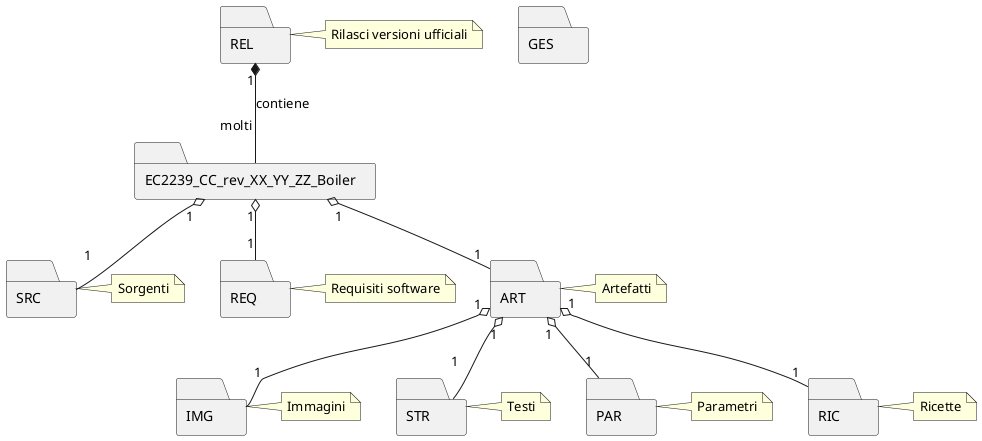

# It works! ;-)

## Section 1

Aenean eu leo quam. Pellentesque ornare sem lacinia quam venenatis vestibulum. Cras mattis consectetur purus sit amet fermentum. Integer posuere erat a ante venenatis dapibus posuere velit aliquet. Praesent commodo cursus magna, vel scelerisque nisl consectetur et. Sed posuere consectetur est at lobortis.

## Section 2

Aenean eu leo quam. Pellentesque ornare sem lacinia quam venenatis vestibulum. Donec ullamcorper nulla non metus auctor fringilla. Cras mattis consectetur purus sit amet fermentum. Donec ullamcorper nulla non metus auctor fringilla. Cras justo odio, dapibus ac facilisis in, egestas eget quam.

Vestibulum id ligula porta felis euismod semper. Maecenas faucibus mollis interdum. Morbi leo risus, porta ac consectetur ac, vestibulum at eros. Lorem ipsum dolor sit amet, consectetur adipiscing elit. Integer posuere erat a ante venenatis dapibus posuere velit aliquet.

[Features](Features.md)

